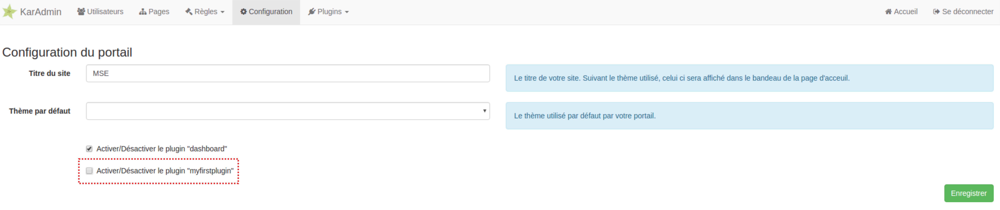

# Créer un plugin

Créer un plugin est la meilleure manière d'étendre/modifier le portail Karambol. Nous verrons ici comment créer son propre plugin et ajouter ses propres fonctionnalités via les mécanismes d'extension de Karambol.

## Table des matières

- [Prérequis](#prérequis)
- [Mise en place du projet](#mise-en-place-du-projet)
- [Installer votre nouveau plugin](#installer-votre-nouveau-plugin)
- [Créer son premier contrôleur](#créer-son-premier-contrôleur)
- [Ajouter des entités à la base de données](#ajouter-des-entités-à-la-base-de-données)
- [Ajouter des fichiers de localisation](#ajouter-des-fichiers-de-localisation)
- [Définir des ressources statiques à déployer](#définir-des-ressources-statiques-à-déployer)

## Prérequis

Vous devez avoir installé ces outils avant de pouvoir commencer à travailler sur votre plugin.

- [Git](https://git-scm.com/)
- [Composer](https://getcomposer.org/)

## Mise en place du projet

### Récupération des sources de Karambol

Afin de créer un plugin, il vous faudra tout d'abord récupérer les sources de Karambol. Le plus simple pour ce faire est de passer par Git.

Dans les exemples qui vont suivre, nous partirons du principe que notre répertoire de travail s'appelle `workspace`.

```bash
cd workspace
git clone https://github.com/Bornholm/karambol.git karambol
```

### Création de l'arborescence de base et initialisation de Composer

Nous allons maintenant créer le répertoire pour notre plugin.
Toujours dans `workspace`:

```bash
mkdir karambol-plugin-myfirstplugin
```

> Notez le préfixe `karambol-plugin-*` dans le nom du répertoire. Cela n'a pas de réelle importance pour le moment, mais dans le futur ce préfixe sera potentiellement utilisé pour mettre en place une interface d'installation graphique de plugins à partir de Github/Packagist.

```shell
cd karambol-plugin-myfirstplugin
composer init # Initialisation interactive du paquet Composer
```

> Une fois la commande `composer init` terminée, vous devriez avoir un fichier `composer.json` présent dans votre dossier.

Créez le répertoire `src` destiné à receuillir votre code source PHP.
```bash
mkdir src
```

Il nous faut maintenant éditer le fichier `composer.json` pour indiquer à composer comment faire le lien entre notre arborescence et les espaces de nom PHP. Modifiez le fichier `composer.json` et ajoutez la section `autoload` suivante:

```json
{
  "name": "<Votre espace de nom>/karambol-plugin-myfirstplugin",
  "authors": [
    {
      "name": "<Votre pseudo>",
      "email": "<Votre email>"
    }
  ],
  "require": {},
  "autoload": {
    "psr-4": {
      "MyFirstPlugin\\": "src/"
    }
  }
}
```

### Création du modèle de configuration du plugin

Créez le répertoire dédié au stockage du/des fichiers de configuration.

```bash
mkdir config
touch config/myfirstplugin.yml
```

Éditez le fichier `config/myfirstplugin.yml` et copiez y les lignes suivantes. Ce fichier sera par la suite copié ou lié dans Karambol afin de déclarer votre plugin.

```yaml
plugins:
  myfirstplugin:
    class: MyFirstPlugin\MyPlugin
    options: ~
```

### Création de la classe d'amorçage de votre plugin

Créer puis éditez le fichier `src/MyPlugin.php`.

```php
<?php

namespace MyFirstPlugin;

use Karambol\KarambolApp;
use Karambol\Plugin\PluginInterface;

class MyPlugin implements PluginInterface {

  public function boot(KarambolApp $app, array $options) {
    // $app est l'instance de l'application Karambol
    // $options est le tableau de paramètres renseignés dans le fichier de configuration de votre plugin.
  }

}
```

> Cette classe est le point d'entrée de votre plugin. C'est à partir d'ici que vous pourrez instancier et monter vos controleurs, utiliser les services exposés par Karambol ou en créer de nouveaux.

## Installer votre nouveau plugin

### Lier votre plugin à votre portail

Placez vous dans le répertoire des sources de votre portail Karambol

```bash
cd ../karambol
```

Créez et/ou éditez le fichier `composer.local.json`.

```json
{
  "repositories": [
    {
      "type": "path",
      "url": "../karambol-plugin-myfirstplugin"
    }
  ],
  "require": {
    "<Votre espace de nom>/karambol-plugin-myfirstplugin": "dev-master"
  }
}
```
> La possibilité de créer un fichier `composer.local.json` est fournie par l'extension [Composer Merge Plugin](https://github.com/wikimedia/composer-merge-plugin) de la fondation Wikimédia.

Mettez à jour vos dépendances via composer:

```bash
composer update <Votre espace de nom>/karambol-plugin-myfirstplugin
```

> Vous devriez avoir à la suite de cette commande un répertoire `vendor/<Votre espace de nom>/karambol-plugin-myfirstplugin` lié symboliquement sur le dossier de votre plugin.

Exposez la configuration de votre plugin dans votre portail:

```bash
PLUGIN_PATH=$(readlink -s ../karambol-plugin-myfirstplugin/config/myfirstplugin.yml)
ln -s "$PLUGIN_PATH" config/local.d/myfirstplugin.yml
```

### Activer votre plugin depuis l'interface d'administration de Karambol

Si ce n'est pas déjà fait, installez et configurez votre portail Karambol en vous basant sur le [guide de l'utilisateur](../index.md) depuis le répertoire des sources. Vous aurez également besoin d'un utilisateur avec les droits d'administration.

Connectez vous sur l'interface d'administration de Karambol et accédez à la page de configuration. Vous devriez avoir quelque chose ressemblant à:



Si vous avez correctement suivi les étapes jusque là vous devriez voir apparaitre l'option _"Activer/Désactiver le plugin myfirstplugin"_.

Cochez la case et enregistrez. Bravo, votre plugin est maintenant chargé automatiquement par Karambol !

## Créer son premier contrôleur et ses vues

> TODO

```php
<?php

namespace MyFirstPlugin;

use Karambol\KarambolApp;
use Karambol\Plugin\PluginInterface;
use Karambol\Controller\Controller;

class MyPlugin implements PluginInterface {

  public function boot(KarambolApp $app, array $options) {


    // Monter son contrôleur sur l'application
    $ctrl = new MyController($app);
    $ctrl->bindTo($app);

    // Ajouter les vues du plugin à Twig
    // en partant du principe que les vues sont dans "src/Views"
    $twigPaths = $app['twig.path'];
    array_unshift($twigPaths, __DIR__.'/Views');
    $app['twig.path'] = $twigPaths;

  }

}

class MyController extends Controller {

  public function mount(KarambolApp $app) {
    $app->get('/my/url', [$this, 'showMyView']);
  }

  public function showMyView() {
    $twig = $this->get('twig');
    // Le fichier de la vue se trouve dans src/Views/plugins/my-first-plugin/
    return $twig->render('plugins/my-first-plugin/index.html.twig');
  }

}

```

## Ajouter des entités à la base de données

> TODO

## Ajouter des fichiers de localisation

> TODO

## Définir des ressources statiques à déployer

> TODO
